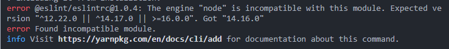

# 基于 Vite2 搭建的 Vue 3 项目，支持 Typescript

这个模板应该可以帮助你开始在 Vite 中使用 Vue 3 和 Typescript 进行开发。
该模板使用 Vue 3 `<script setup>` 语法糖，查看 [script setup docs](https://v3.vuejs.org/api/sfc-script-setup.html#sfc-script-setup) 了解更多的。

## 1.默认描述

### 推荐的 IDE 设置

- [VSCode](https://code.visualstudio.com/) + [Volar](https://marketplace.visualstudio.com/items?itemName=johnsoncodehk.volar)

### 类型支持 TS 中的 `.vue` 导入

由于 TypeScript 无法处理 .vue 导入的类型信息，
默认情况下，它们被填充为通用的 Vue 组件类型。

在大多数情况下，如果您并不真正关心模板之外组件的 props 类型。
然而，如果希望在 `.vue` 导入中获得实际的 props 类型，
（例如，使用手动 `h(...)` 调用时获取 props 验证），
可以通过从 VSCode 命令面板运行 `Volar: Switch TS Plugin on/off` 来启用 Volar 的 `.vue` 类型支持插件。

## 2.项目初始化

###2.1 package 命令：

```bash
# 安装依赖
yarn
pnpm i

# 启动本地服务
yarn serve

# 修复代码
yarn lint

# 测试服务器打包
yarn build:test

# 感知网(东区/西区)服务器打包
yarn build:perceive-east
yarn build:perceive-west

# 公安网(东区/西区)服务器打包
yarn build:police-east
yarn build:police-west
```

### 2.2 安装的插件/组件库

#### 2.2.1 [element-plus](https://element-plus.gitee.io/zh-CN/component/button.html)

Element 支持 Vue3 的版本，由于 element-plus 是 beta 版本，所以不强制使用，后续做更改；

当然，也可以使用[ant-design-vue](https://next.antdv.com/docs/vue/migration-v3-cn)的 v2/v3(beta)版本，但是不建议使用 v2，因为它不支持 vue3 的新特性

或者[Tdesign-next](https://tdesign.tencent.com/vue-next/components/overview)，但 Tdesgin 还在 alpha 版本，可以了解，不建议使用

#### 2.2.2 [vite-plugin-svg-icons](https://github.com/vbenjs/vite-plugin-svg-icons/blob/HEAD/README.zh_CN.md)

生成 svg 雪碧图。

- 配置：

step1： vite.config.ts

```ts
import viteSvgIcons from "vite-plugin-svg-icons";
import path from "path";

export default () => {
  return {
    plugins: [
      viteSvgIcons({
        // 指定需要缓存的图标文件夹
        iconDirs: [path.resolve(process.cwd(), "src/assets/icons")],
        // 指定symbolId格式
        symbolId: "icon-[dir]-[name]",
      }),
    ],
  };
};
```

step2： 在 src/main.ts 内引入注册脚本

```ts
import "virtual:svg-icons-register";
```

#### 2.2.3 [vite-plugin-compression](https://github.com/vbenjs/vite-plugin-compression/blob/HEAD/README.zh_CN.md)

使用 gzip 或者 brotli 来压缩资源

- vite.config.ts 中的配置插件

```ts
import viteCompression from "vite-plugin-compression";

export default () => {
  return {
    plugins: [viteCompression()],
  };
};
```

#### 2.2.4 [unplugin-auto-import](https://github.com/antfu/unplugin-auto-import#readme)

自动导入函数插件

- 配置：

```ts
// 自动导入函数插件
import AutoImport from "unplugin-auto-import/vite";

export default defineConfig({
  plugins: [
    AutoImport({
      // Auto import functions from Vue, e.g. ref, reactive, toRef...
      // 自动导入 Vue 相关函数，如：ref, reactive, toRef 等
      imports: ["vue"],

      // Auto import functions from Element Plus, e.g. ElMessage, ElMessageBox... (with style)
      // 自动导入 Element Plus 相关函数，如：ElMessage, ElMessageBox... (带样式)
      resolvers: [ElementPlusResolver()],

      dts: path.resolve(_resolve("src"), "auto-imports.d.ts"),
    }),
  ],
});
```

##3.使用 Typescript
Vite 天然支持引入`.ts`文件。

```json
{
  "compilerOptions": {
    "types": ["vite/client"],
    "baseUrl": "src",
    "paths": {
      "@/*": ["./*"]
    }
  },
  "exclude": ["node_modules"]
}
```

##4.配置环境变量
vite 提供了两种模式：具有开发服务器的开发模式（development）和生产模式（production）。
本架构基于公司现有应用，创建了四个生产环境和、、一个测试环境、一个本地环境

####1）以默认`.env`文件为例

地图服务暂时仅使用 **电子地图** 和 **卫星地图**

```dotenv
# 默认运行的名称
VITE_APP_RUNTIME_ENV=default
# 默认服务器地址
VITE_APP_REQUEST_URL=172.16.1.150:9000
# 默认地图服务器地址
VITE_APP_MAP_URL=10.10.7.200:9000
# 默认电子地图ID
VITE_APP_MAP_STREET_ID=0v8b4qex
# 默认卫星地图ID
VITE_APP_MAP_SATELLITE_ID=18bsypjc
```

##5.按需自动引入组件

[unplugin-vue-components](https://github.com/antfu/unplugin-vue-components/)
是一款非常强大的插件，
核心功能就是帮助你自动按需引入组件，Tree-shakable，只注册你使用的组件。
这里说一下两个核心使用方式和配置方式。

> 此插件不仅支持 vue3，同时也支持 vue2，并且支持 Vite、Webpack、Vue CLI、Rollup

###5.1 安装与配置
安装：

```
npm i unplugin-vue-components -D
```

配置：

```ts
// vite.config.ts
import Components from "unplugin-vue-components/vite";

export default defineConfig({
  plugins: [
    Components({
      /* options */
    }),
  ],
});
```

这里的 options 可以配置一些选项，后面提到的组件库注册会使用到

###5.2 改变全局组件注册方式

我们通常将全局的组件封装在 @/src/components 中，然后通过 app.component() 注册全局组件。
使用此插件后，无需手写注册，直接在模板中使用组件即可：

引入官方的示例：

```vue
<template>
  <div>
    <HelloWorld msg="Hello Vue 3.0 + Vite" />
  </div>
</template>

<script>
export default {
  name: "App",
};
</script>
```

自动编译为：

```vue
<template>
  <div>
    <HelloWorld msg="Hello Vue 3.0 + Vite" />
  </div>
</template>

<script>
import HelloWorld from "./src/components/HelloWorld.vue";

export default {
  name: "App",
  components: {
    HelloWorld,
  },
};
</script>
```

###5.3 自动引入组件库

在使用组件库时，常规组件我们也会注册到全局；
如果使用局部注册（手动按需引入）由于页面中会使用到多个组件，会非常麻烦，故使用该插件自动引入；
该项目使用 element-plus 组件库。

```ts
// vite.config.js
import ViteComponents, {
  ElementPlusResolver,
} from "unplugin-vue-components/resolvers";

// your plugin installation
export default defineConfig({
  plugins: [
    // 自动引入组件
    Components({
      resolvers: [ElementPlusResolver()],
    }),
  ],
});
```

配置完成后，即可在组件中直接使用 element-plus 组件，无需引入

##6.样式

项目建议使用通用样式，可以创建 src/styles 目录存放

推荐分类：

```dotenv
styles
  ├── elem # 组件库样式覆盖，命名自取，以 elem 为例
  ├── color.scss # 颜色
  ├── index.scss # 入口
  ├── global.scss # 公共类
  ├── transition.scss # 动画相关
  └── variable.scss # 变量
```

###6.1 预设基础样式

`normalize.css`是一个基础的样式库，它可以重置 css 样式，使各浏览器效果保持一致。

###6.2 CSS 预处理器
虽然 vite 原生支持 less/sass/scss/stylus，但是你必须手动安装他们的预处理器依赖;

本项目使用**scss**：`npm install -D scss`

###6.3 开启 scoped
没有加 scoped 属性，会编译成全局样式，造成全局污染。

```vue
<style scoped></style>
```

###6.4 深度选择器
如果你希望 scoped 样式中的一个选择器能够穿透时，请使用`::v-deep`。（禁止使用`/deep/`）

##7.布局

页面整体布局是一个产品最外层的框架结构，往往会包含导航、页脚、侧边栏等。在页面之中，也有很多区块的布局结构。

在真实项目中，页面布局通常统领整个应用的界面，有非常重要的作用，所以单独拆分出来也是非常有必要的。

在脚手架中，所有的通用布局组件都应该放在 src/layouts 中，这种封装比较简单。

###7.1 常规的布局
BasicLayout
基础页面布局，应包含顶部、底部两栏

BlankLayout
空白的布局。

###7.2 特殊的布局

UserLayout
将用户登录注册等页面抽离出来。

##8.集成 Tailwind.css

项目采用`reset.scss`重置样式，该文件由老项目的`reset.scss`

[tailwind](https://www.tailwindcss.cn/docs/installation) 是一个 css 框架；
它使用类(`class`)来控制样式，内部封装了数量庞大的样式选项供开发者使用。

该项目推荐使用 Tailwind ，但是不强制使用

由此一来，基本很少再使用 `<style>` 标签去转本定义一些 `class` 和样式，
因为定义类名需要**规范**和**英文**
使用`tailwind.CSS`后，预处理器的作用就会显得微乎其微，
因为无需再自定定义各种变量和 mixins。

###8.1 效率提升

关于样式要与结构分离的话题，tailwind 显然是一个与 HTML 紧密结合的工具；
但因为现在使用 vue 框架，结果是高度组件化，样式分离是为了方便复用和维护，但在组件化面前样式分离只能是降低开发效率。

tailwind 提升效率的方面：

- 提供了大量的功能类，极大的提高了可维护性
- 响应式设计，各种设备只需要一次配置
- 悬停、焦点和其它状态
- 深色模式

###8.2 JIT 模式

当前环境支持 postcss8（vue/cli 构建的 vue2 项目是 postcss7）

如果你的环境支持 postcss8（ vue/cli 构建的 vue2 项目是 postcss7 ），那么 JIT 模式直接带你起飞。

它的优势：

- 超快的构建速度
- 支持变体，你甚至可以这么写 sm:hover:active:disabled:opacity-75
- 支持任意样式，例如 md:top-[-113px]
- 开发和生产环境结果是一致的（vue2 项目可能出现组件库构建结果不一致的问题）

使用 vscode 的同学，强烈建议安装
[Tailwind CSS IntelliSense](https://marketplace.visualstudio.com/items?itemName=bradlc.vscode-tailwindcss)
插件，它可以自动补全类名，显著降低学习成本

###8.3 打包体积
使用默认配置，未压缩是 3739.4kB，
Gzip 压缩 是 293.9kB，Brotli 压缩 是 73.2kB。
这样会使项目包过大（虽然我们不在乎包的大小），
这因为 tailwind 提供了成千上万的功能类，其中绝大部分不会使用到。

当构建生产时，你应该使用 purge 选项来 tree-shake 优化未使用的样式，
并优化您的最终构建大小当使用 Tailwind 删除未使用的样式时，
最终很难得到超过 10kb 的压缩 CSS。

- tailwind.config.js 增加配置：

```js
module.exports = {
  purge: ["./index.html", "./src/**/*.{vue,js,ts,jsx,tsx}"],
};
```

还有一点`Atom CSS`极大的提升了样式的复用程度，从而直接降低了构建体积

## 9.Pinia 状态管理

由于 Vuex4 对于 TypeScript 的支持一言难尽（需要极其繁琐的配置），
所以项目使用[Pinia](https://pinia.vuejs.org)进行状态管理，
同时 Vue devtools 支持 Pinia。

```tree
├─src
  └─store
    ├─user
    ├─login
    └─other
```

### 9.1 Pinia 的优势

- **Pinia** 的 API 设计非常接近`Vuex 5`的提案（作者是 Vue 核心团队成员）
- 无需像`Vuex 4`自定义复杂的类型来支持 typescript，天生具备完美的类型推断
- 模块化设计，引入的每一个 store 在打包时都可以自动拆分他们
- 无嵌套结构，但可以在任意的 store 之间交叉组合使用
- Pinia 与 Vue devtools 挂钩，不会影响 Vue 3 开发体验

### 9.2 创建 Store

Pinia 已经内置在脚手架中，并且与 vue 已经做好了关联，你可以在任何位置创建一个 store

每个单独的 store 暴露方法名称采用`useNameStore`（**小驼峰**）；
并且必须有单独的`id`，命名方式采用`name-store`形式（**中划线**），
两个 name 与保持一致，方便 devtools 中查看数据

```ts
import { defineStore } from "pinia";

export const useUserStore = defineStore({
  id: "user-store",
  state: () => ({
    name: "ming",
  }),
  getters: {},
  actions: {},
});
```

这与 Vuex 有很大不同，它是标准的 Javascript 模块导出，
这种方式也让开发人员和 IDE 更加清楚 store 来自哪里。

Pinia 与 Vuex 的区别：

- **id** 是必要的，它将所使用 store 连接到 devtools，不同的仓库使用`id`区分
- 创建方式：`new Vuex.Store(...)`(vuex3)，`createStore(...)`(vuex4)。
- 对比于 vuex3 ，state 现在是一个**函数返回对象**。
- 没有 **mutations**，不用担心，state 的变化依然记录在 devtools 中。

### 9.3 State

- 创建 store

创建好后，在 state 中新增属性：

```ts
state: () => ({
  name: "ming",
  age: 18,
});
```

将 store 中的 state 属性设置为一个函数，该函数返回一个包含不同状态值的对象，
这与我们在组件中定义数据的方式非常相似。

- 在模板中使用 store：

可以从 store 中获取到 age 的状态，并修改状态：

```vue
<script setup lang="ts">
// 引入userStore仓库
import { useUserStore } from "/src/store";
const userStore = useUserStore();
</script>

<template>
  <div @click="userStore.age++">{{ userStore.age }}</div>
</template>
```

注意这里并**不需要**这样写`userStore.state.age`；

虽然上面的写法很舒适，但是不可以用解构的方式去提取它内部的值，这样的话，会失去它的响应式：

```ts
// 这种写法会失去响应式
let { name, age } = useUserStore();
```

### 9.4 Getters

Pinia 中的 getter 与 Vuex 中的 getter 、组件中的计算属性具有相同的功能，
传统的函数声明使用 this 代替了 state 的传参方法，
但箭头函数还是要使用函数的第一个参数来获取 state

- 创建

```ts
{
  getters: {
    nameLength(): number{
      return this.name.length
    }
  }
  // 或
  getters: {
    nameLength: state => state.name.length
    // nameLength: ()=> this.name.length ❌
  }
}
```

- 使用

```ts
{
  {
    userStore.nameLength;
  }
}
```

### 9.5 Actions

这里与 Vuex 有极大的不同，Pinia 仅提供了一种方法来定义如何更改状态的规则，
放弃 mutations 只依靠 Actions。

#### ① 特点：

Pinia 让 Actions 使用起来更加的灵活：

- 可以通过组件或其他 action 调用
- 可以从其他 store 的 action 中调用
- 直接在商店实例上调用
- 支持**同步**或**异步**
- 有任意数量的参数
- 可以包含有关如何更改状态的逻辑（也就是 vuex 的 mutations 的作用）
- 可以`$patch`方法直接更改状态属性

#### ② 使用：

store 中设置 actions：

```ts
actions: {
  async getData(page){
    await requsetData(page);
    this.name = 'xxx';
  }
}
```

组件中使用：

```vue
<script lang="ts" setup>
import { definedStore } from "@/store";

const defStore = definedStore();

defStore.getData(2);
</script>
```

## 10.基于 mitt 处理组件间事件联动

后续补充，暂时不用

## 11.异步请求

对于存在大量的接口的项目，需要做到以下几点：

- 封装请求。
- 统一的 API 接口管理。
- Mock 数据功能（该项目暂无此项功能）

目的是在帮助我们简化代码和利于后期的更新维护

### 11.1 基于 axios 的封装

axios 作为 PC、移动端项目中最常用的请求工具，在这里提供一些封装的思路：

- 通过 `import.meta.env.VITE_APP_BASE_URL` 获取环境变量，配置 baseURL，
  如果接口存在多个不同域名，可以通过 js 变量控制。
- 设置 timeout 请求超时、断网情况处理。
- 设置请求头，携带 token。
- 异常拦截处理，后端通过你携带的 token 判断你是否过期，
  如果返回 401 你可能需要跳转到登录页面，并提示需要重新登录。
- 响应拦截，通常后端返回 code、data、msg，如果是请求正常，
  我们可以直接返回 data 数据，如果是异常的 code，我们也可以在这里直接弹出报错提示。
- 中断请求，例如页面切换时，我们要中断正在发生的请求（缺少）。

### 11.2 为 axios 增加泛型的支持

到目前为止，axios 请求返回的类型是 any，
这时我们对请求后的数据进行操作时，浪费了 ts 带来的类型提示。

这时我们要做的就是重新声明 axios 模块：

```ts
// 定义调用传输的参数
interface Http {
  get<T>(url: string, config?: AxiosRequestConfig): Promise<ResType<T>>;
  delete<T>(url: string, config?: AxiosRequestConfig): Promise<ResType<T>>;
  post<T>(
    url: string,
    data?: any,
    config?: AxiosRequestConfig
  ): Promise<ResType<T>>;
  put<T>(
    url: string,
    data?: any,
    config?: AxiosRequestConfig
  ): Promise<ResType<T>>;
}
```

### 11.3 统一的 API 接口管理

自从前端和后端分家之后，前后端接口对接就成为了常态，而对接接口的过程就离不开接口文档。

```ts
// 定义接口，限制请求&响应数据类型
interface ResType<T> {
  code: number | string;
  data?: T;
  msg: string;
}
```

### 11.5 mock

(缺少)
vite 使用 mock 数据非常简单，使用 vite-plugin-mock 插件，mock 数据。

## 12.路由

路由和菜单是组织起一个应用的关键骨架。

###12.1 创建路由

- 使用 **createRouter** 创建路由，这时候根据需求选择 Hash 路由或者 History 路由。
  一般选用 Hash 模式
- 根据业务需求配置路由，常用路由包括 Home/Login/404
- 如果有权限相关的业务，你需要创建 permission.ts 在路由钩子触发时做一些事情

> 页面比较多时，需要创建 routes 目录，分模块声明路由。

###12.2 使用 meta 丰富你的路由（缺失）
vue-router4 支持 typescript，配置路由的类型是 RouteRecordRaw，
这里 meta 可以让我们有更多的发挥空间

一些参考：

- title: string; 页面标题，通常必选。
- icon?: string; 图标，一般配合菜单使用。
- auth?: boolean; 是否需要登录权限。
- ignoreAuth?: boolean; 是否忽略权限。
- roles?: RoleEnum[]; 可以访问的角色
- keepAlive?: boolean; 是否开启页面缓存
- hideMenu?: boolean; 有些路由我们并不想在菜单中显示，比如某些编辑页面。
- order?: number; 菜单排序。
- frameUrl?: string; 嵌套外链。

## 13.项目性能与细节优化

### 13.1 开启 gzip

项目暂时不开启压缩

### 13.2 页面载入进度条

页面路由切换/数据请求时，附带一个加载进度条会显得非常友好，
不至于白屏时间过长，让用户以为页面假死。

这时候我们可以用到 nprogress，在路由切换时开启和关闭：
安装：

```text
pnpm add nprogress
pnpn add @types/nprogress
```

```ts
import NProgress from "nprogress";
import "nprogress/nprogress.css";

router.beforeEach(async (to, from, next) => {
  // 进度条开始
  NProgress.start();
});

router.afterEach((to) => {
  // 进度条结束
  NProgress.done();
});
```

### 13.3 Title

在不同的路由下显示不同的标题是常规的操作，我们可以通过路由钩子获取 meta 中的 title 属性改变标签页上的 title。
你可以使用 vueuse 提供的 useTitle，或者 window.document.title 自行封装。
你也可以通过环境变量将你的主标题拼接在路由标题的后面：

```ts
const { VITE_APP_TITLE } = import.meta.env;
```

### 13.4 常用的 JavaScript 库

[vueuse](https://vueuse.org)，vue 的库，非常强大
[lodash](https://www.lodashjs.com)，js 的函数库

## 14.代码风格与流程规范

### 14.1 ESLint

- 作用： 提高后期维护时阅读代码的效率，规范团队合作

#### 1）安装：

```dotenv
# eslint 安装
yarn add eslint --dev

# eslint 插件安装
yarn add eslint-plugin-vue --dev
yarn add @typescript-eslint/eslint-plugin --dev
yarn add eslint-plugin-prettier --dev

# typescript parser
yarn add @typescript-eslint/parser --dev
```

注意: 如果 eslint 安装报错:

可以尝试运行以下命令:

```dotenv
yarn config set ignore-engines true
```

运行成功后再次执行 eslint 安装命令

#### 2）新建 .eslintrc.js

> 配置 eslint 校验规则:

```js
module.exports = {
  root: true,
  env: {
    browser: true,
    node: true,
    es2021: true,
  },
  parser: "vue-eslint-parser",
  extends: [
    "eslint:recommended",
    "plugin:vue/vue3-recommended",
    "plugin:@typescript-eslint/recommended",
    "plugin:prettier/recommended",
    // eslint-config-prettier 的缩写
    "prettier",
  ],
  parserOptions: {
    ecmaVersion: 12,
    parser: "@typescript-eslint/parser",
    sourceType: "module",
    ecmaFeatures: {
      jsx: true,
    },
  },
  // eslint-plugin-vue @typescript-eslint/eslint-plugin eslint-plugin-prettier缩写
  plugins: ["vue", "@typescript-eslint", "prettier"],
  rules: {
    "@typescript-eslint/ban-ts-ignore": "off",
    "@typescript-eslint/no-unused-vars": "off",
    "@typescript-eslint/explicit-function-return-type": "off",
    "@typescript-eslint/no-explicit-any": "off",
    "@typescript-eslint/no-var-requires": "off",
    "@typescript-eslint/no-empty-function": "off",
    "@typescript-eslint/no-use-before-define": "off",
    "@typescript-eslint/ban-ts-comment": "off",
    "@typescript-eslint/ban-types": "off",
    "@typescript-eslint/no-non-null-assertion": "off",
    "@typescript-eslint/explicit-module-boundary-types": "off",
    "no-var": "error",
    "prettier/prettier": "error",
    // 禁止出现console
    "no-console": "warn",
    // 禁用debugger
    "no-debugger": "warn",
    // 禁止出现重复的 case 标签
    "no-duplicate-case": "warn",
    // 禁止出现空语句块
    "no-empty": "warn",
    // 禁止不必要的括号
    "no-extra-parens": "off",
    // 禁止对 function 声明重新赋值
    "no-func-assign": "warn",
    // 禁止在 return、throw、continue 和 break 语句之后出现不可达代码
    "no-unreachable": "warn",
    // 强制所有控制语句使用一致的括号风格
    curly: "warn",
    // 要求 switch 语句中有 default 分支
    "default-case": "warn",
    // 强制尽可能地使用点号
    "dot-notation": "warn",
    // 要求使用 === 和 !==
    eqeqeq: "warn",
    // 禁止 if 语句中 return 语句之后有 else 块
    "no-else-return": "warn",
    // 禁止出现空函数
    "no-empty-function": "warn",
    // 禁用不必要的嵌套块
    "no-lone-blocks": "warn",
    // 禁止使用多个空格
    "no-multi-spaces": "warn",
    // 禁止多次声明同一变量
    "no-redeclare": "warn",
    // 禁止在 return 语句中使用赋值语句
    "no-return-assign": "warn",
    // 禁用不必要的 return await
    "no-return-await": "warn",
    // 禁止自我赋值
    "no-self-assign": "warn",
    // 禁止自身比较
    "no-self-compare": "warn",
    // 禁止不必要的 catch 子句
    "no-useless-catch": "warn",
    // 禁止多余的 return 语句
    "no-useless-return": "warn",
    // 禁止变量声明与外层作用域的变量同名
    "no-shadow": "off",
    // 允许delete变量
    "no-delete-var": "off",
    // 强制数组方括号中使用一致的空格
    "array-bracket-spacing": "warn",
    // 强制在代码块中使用一致的大括号风格
    "brace-style": "warn",
    // 强制使用骆驼拼写法命名约定
    camelcase: "warn",
    // 强制使用一致的缩进
    indent: "off",
    // 强制在 JSX 属性中一致地使用双引号或单引号
    // 'jsx-quotes': 'warn',
    // 强制可嵌套的块的最大深度4
    "max-depth": "warn",
    // 强制最大行数 300
    // "max-lines": ["warn", { "max": 1200 }],
    // 强制函数最大代码行数 50
    // 'max-lines-per-function': ['warn', { max: 70 }],
    // 强制函数块最多允许的的语句数量20
    "max-statements": ["warn", 100],
    // 强制回调函数最大嵌套深度
    "max-nested-callbacks": ["warn", 3],
    // 强制函数定义中最多允许的参数数量
    "max-params": ["warn", 3],
    // 强制每一行中所允许的最大语句数量
    "max-statements-per-line": ["warn", { max: 1 }],
    // 要求方法链中每个调用都有一个换行符
    "newline-per-chained-call": ["warn", { ignoreChainWithDepth: 3 }],
    // 禁止 if 作为唯一的语句出现在 else 语句中
    "no-lonely-if": "warn",
    // 禁止空格和 tab 的混合缩进
    "no-mixed-spaces-and-tabs": "warn",
    // 禁止出现多行空行
    "no-multiple-empty-lines": "warn",
    // 禁止出现;
    semi: ["warn", "never"],
    // 强制在块之前使用一致的空格
    "space-before-blocks": "warn",
    // 强制在 function的左括号之前使用一致的空格
    // 'space-before-function-paren': ['warn', 'never'],
    // 强制在圆括号内使用一致的空格
    "space-in-parens": "warn",
    // 要求操作符周围有空格
    "space-infix-ops": "warn",
    // 强制在一元操作符前后使用一致的空格
    "space-unary-ops": "warn",
    // 强制在注释中 // 或 /* 使用一致的空格
    // "spaced-comment": "warn",
    // 强制在 switch 的冒号左右有空格
    "switch-colon-spacing": "warn",
    // 强制箭头函数的箭头前后使用一致的空格
    "arrow-spacing": "warn",
    "no-var": "warn",
    "prefer-const": "warn",
    "prefer-rest-params": "warn",
    "no-useless-escape": "warn",
    "no-irregular-whitespace": "warn",
    "no-prototype-builtins": "warn",
    "no-fallthrough": "warn",
    "no-extra-boolean-cast": "warn",
    "no-case-declarations": "warn",
    "no-async-promise-executor": "warn",
  },
  globals: {
    defineProps: "readonly",
    defineEmits: "readonly",
    defineExpose: "readonly",
    withDefaults: "readonly",
  },
};
```

#### 3）项目下新建 .eslintignore

```ignore
# eslint 忽略检查 (根据项目需要自行添加)
node_modules
dist
```

### 14.2 prettier 支持

prettier 用于规范代码样式

#### 1）安装

```dotenv
# 安装 prettier
yarn add prettier --dev
```

#### 2）解决 eslint 和 prettier 冲突

> 解决 ESLint 中的样式规范和 prettier 中样式规范的冲突，
> 以 prettier 的样式规范为准，使 ESLint 中的样式规范自动失效

```dotenv
# 安装插件 eslint-config-prettier
yarn add eslint-config-prettier --dev
```

#### 3）项目下新建 .prettier.js

- 配置 prettier 格式化规则:

```js
module.exports = {
  tabWidth: 2,
  jsxSingleQuote: true,
  jsxBracketSameLine: true,
  printWidth: 100,
  singleQuote: true,
  semi: false,
  overrides: [
    {
      files: "*.json",
      options: {
        printWidth: 200,
      },
    },
  ],
  arrowParens: "always",
};
```

#### 4）项目下新建 .prettierignore

```ignore
# 忽略格式化文件 (根据项目需要自行添加)
node_modules
dist
```

#### 5）package.json 新增配置

```json
{
  "script": {
    "lint": "eslint src --fix --ext .ts,.tsx,.vue,.js,.jsx",
    "prettier": "prettier --write ."
  }
}
```

#### 6）测试使用

```dotenv
# eslint 检查
pnpm lint
# prettier 自动格式化
pnpm prettier
```

### 14.3 配置 husky + lint-staged

> 使用 husky + lint-staged 助力团队编码规范, husky&lint-staged
> 安装推荐使用 mrm, 它将根据 package.json
> 依赖项中的代码质量工具来安装和配置 husky 和 lint-staged

## n.xxx

src 文件内容

```tree
├─src
  ├─components
  │  └─svg
  ├─router
  ├─store
  ├─styles
  ├─utils
  └─views
```
